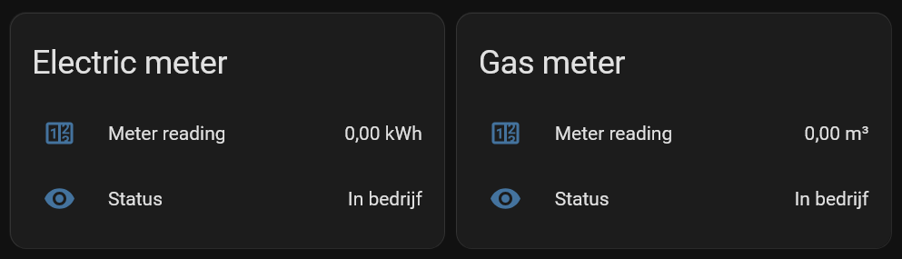

# Liander Home Assistant Integration
This is a custom integration for [Home Assistant](https://www.home-assistant.io/) to fetch electricity and gas meter readings from Liander.

## Features
- Retrieves electricity and gas meter readings for your Liander accounts.
- Updates meter readings automatically once every 24 hours.
- Provides sensors for each connection with appropriate units and device classes.

## Sensors
The integration creates the following sensors for each connection:

| Sensor Key       | Description       | Device Class         | Unit of Measurement       |
|-----------------|-----------------|-------------------|-------------------------|
| `meter_reading` | Meter reading     | `energy` (electricity) / `gas` (gas) | `kWh` (electricity) / `m³` (gas) |
| `status`        | Connection status | None              | None                    |

### Notes
- Electricity readings are reported in kilowatt-hours (`kWh`).
- Gas readings are reported in cubic meters (`m³`).
- Only cumulative readings are tracked (`state_class: total_increasing`).

## Installation
### HACS (recommended)
Click the button below to quickly install this integration through HACS

### Manual
1. Download this repository.
2. Place the `ha-liander` folder in your Home Assistant `custom_components` directory.
3. Restart Home Assistant.

## Configuration
1. Go to **Settings > Devices & Services > Integrations**.
2. Click **Add Integration**.
3. Search for **Liander**.
4. Enter your **Liander username and password**.
5. Home Assistant will automatically discover your electricity and gas connections.

## Privacy Notice
This integration only uses your credentials to authenticate with Liander’s API.  
No data is sent anywhere other than between Home Assistant and Liander.